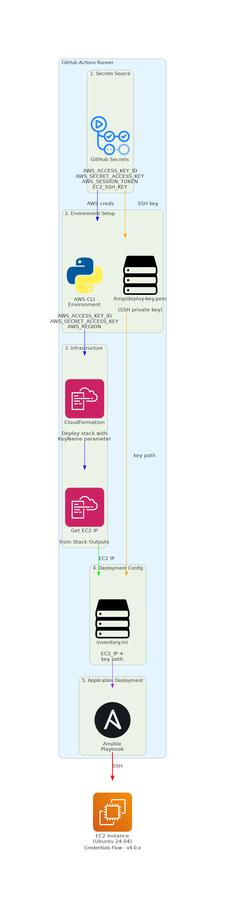

# GitHub Workflows - v4.0.x

This folder contains the CI/CD workflows for the hello-world application.

## Quick Reference

| Workflow | Trigger | Purpose |
|----------|---------|---------|
| `release.yml` | Tag push (`v*`) | Lint, test, build, create GitHub release |
| `deploy.yml` | Release published / Manual | Deploy to AWS with CloudFormation + Ansible |

## How to Trigger a Release

1. Create and push a version tag:
   ```bash
   git tag -a v4.0.1 -m "Release v4.0.1"
   git push origin v4.0.1
   ```

2. The release workflow will:
   - Run linting and tests
   - Build the Python package
   - Create a GitHub release with artifacts

3. The deploy workflow will automatically trigger when the release is published

## Manual Deployment

To deploy without creating a release:

1. Go to **Actions** → **Deploy** → **Run workflow**
2. Select the branch and click **Run workflow**

## Files

| File | Description |
|------|-------------|
| `release.yml` | Release workflow with lint, test, build jobs |
| `deploy.yml` | Deployment workflow with CloudFormation and Ansible |
| `docs/ARCHITECTURE.md` | Detailed architecture documentation |
| `docs/cicd-architecture.png` | Architecture diagram |
| `docs/cicd-architecture.dot` | Graphviz source for diagram |
| `docs/cicd-architecture.drawio` | Editable diagram (draw.io format) |

## Required Secrets

Configure these secrets in your repository settings:

- `AWS_ACCESS_KEY_ID` - AWS access key
- `AWS_SECRET_ACCESS_KEY` - AWS secret key
- `AWS_SESSION_TOKEN` - AWS session token (optional, for temporary credentials)
- `EC2_SSH_KEY` - SSH private key for EC2 access

---

## Credentials Flow Deep Dive

This section explains how credentials are captured, stored, and used throughout the deployment pipeline.

### Overview Diagram



**Connection Color Legend:**

| Color  | Description                              |
|--------|------------------------------------------|
| Blue   | AWS credentials flow                     |
| Orange | SSH private key flow                     |
| Green  | EC2 IP address from CloudFormation       |
| Purple | Combined inventory (IP + key path)       |
| Red    | SSH connection to EC2                    |

### Step 1: AWS Credentials Configuration

**File:** `.github/workflows/deploy.yml` (lines 21-27)

```yaml
- name: Configure AWS credentials
  uses: aws-actions/configure-aws-credentials@v4
  with:
    aws-access-key-id: ${{ secrets.AWS_ACCESS_KEY_ID }}
    aws-secret-access-key: ${{ secrets.AWS_SECRET_ACCESS_KEY }}
    aws-session-token: ${{ secrets.AWS_SESSION_TOKEN }}
    aws-region: ${{ env.AWS_REGION }}
```

**What happens:**
1. The `aws-actions/configure-aws-credentials@v4` action reads secrets from GitHub's encrypted secrets store
2. It sets environment variables (`AWS_ACCESS_KEY_ID`, `AWS_SECRET_ACCESS_KEY`, `AWS_SESSION_TOKEN`, `AWS_DEFAULT_REGION`) in the runner
3. All subsequent `aws` CLI commands automatically use these credentials
4. The `AWS_SESSION_TOKEN` is optional - only needed when using temporary credentials (e.g., from AWS SSO or assumed roles)

### Step 2: SSH Key Pair Handling

**File:** `.github/workflows/deploy.yml` (lines 29-41)

```yaml
- name: Create or use existing key pair
  run: |
    # Check if key exists, create if not
    if ! aws ec2 describe-key-pairs --key-names ${{ env.KEY_NAME }} 2>/dev/null; then
      aws ec2 create-key-pair \
        --key-name ${{ env.KEY_NAME }} \
        --query 'KeyMaterial' \
        --output text > /tmp/deploy-key.pem
    else
      # Use stored key from secrets
      echo "${{ secrets.EC2_SSH_KEY }}" > /tmp/deploy-key.pem
    fi
    chmod 600 /tmp/deploy-key.pem
```

**Two scenarios:**

#### Scenario A: First Deployment (Key Pair Does Not Exist)

1. `aws ec2 describe-key-pairs --key-names hello-world-deploy-key` fails (returns non-zero)
2. `aws ec2 create-key-pair` creates a new key pair in AWS
3. AWS returns the **private key material** (this is the only time AWS provides it)
4. The `--query 'KeyMaterial'` extracts just the private key PEM content
5. The private key is written to `/tmp/deploy-key.pem`
6. **Important:** You must save this private key to `EC2_SSH_KEY` secret for future deployments

#### Scenario B: Subsequent Deployments (Key Pair Exists)

1. `aws ec2 describe-key-pairs --key-names hello-world-deploy-key` succeeds
2. The existing private key is retrieved from `EC2_SSH_KEY` GitHub secret
3. The private key is written to `/tmp/deploy-key.pem`

**File permissions:**
```bash
chmod 600 /tmp/deploy-key.pem
```
SSH requires private keys to have restricted permissions (owner read/write only).

### Step 3: CloudFormation Receives the Key Name

**File:** `.github/workflows/deploy.yml` (lines 43-49)

```yaml
- name: Deploy CloudFormation stack
  run: |
    aws cloudformation deploy \
      --template-file infra/cloudformation.yml \
      --stack-name ${{ env.STACK_NAME }} \
      --parameter-overrides KeyName=${{ env.KEY_NAME }} \
      --no-fail-on-empty-changeset
```

**File:** `infra/cloudformation.yml` (lines 4-8, 95-106)

```yaml
Parameters:
  KeyName:
    Type: String
    Description: EC2 Key Pair name for SSH access
    Default: ''

# ...

EC2Instance:
  Type: AWS::EC2::Instance
  Properties:
    InstanceType: t3.micro
    ImageId: !FindInMap [RegionAMI, !Ref 'AWS::Region', AMI]
    KeyName: !If [HasKeyName, !Ref KeyName, !Ref 'AWS::NoValue']
    # ...
```

**What happens:**
1. The `KeyName` parameter (`hello-world-deploy-key`) is passed to CloudFormation
2. CloudFormation looks up the **public key** associated with this key pair name in AWS
3. When the EC2 instance launches, AWS injects the public key into `~/.ssh/authorized_keys` for the `ubuntu` user
4. The condition `HasKeyName` ensures the key is only attached if provided

**Key insight:** CloudFormation only needs the **key pair name** (not the private key). AWS already has the public key stored from when the key pair was created.

### Step 4: Retrieving EC2 Public IP

**File:** `.github/workflows/deploy.yml` (lines 60-67)

```yaml
- name: Get EC2 public IP
  id: get-ip
  run: |
    IP=$(aws cloudformation describe-stacks \
      --stack-name ${{ env.STACK_NAME }} \
      --query 'Stacks[0].Outputs[?OutputKey==`PublicIP`].OutputValue' \
      --output text)
    echo "ec2_ip=$IP" >> $GITHUB_OUTPUT
```

**File:** `infra/cloudformation.yml` (lines 111-114)

```yaml
Outputs:
  PublicIP:
    Description: Public IP of EC2 instance
    Value: !GetAtt EC2Instance.PublicIp
```

**What happens:**
1. CloudFormation stack exports the EC2 public IP as an output named `PublicIP`
2. The workflow queries CloudFormation for this output value
3. The JMESPath query `Stacks[0].Outputs[?OutputKey==\`PublicIP\`].OutputValue` extracts the IP
4. The IP is stored in GitHub Actions output variable `ec2_ip` for use in subsequent steps

### Step 5: Dynamic Ansible Inventory Creation

**File:** `.github/workflows/deploy.yml` (lines 69-74)

```yaml
- name: Create Ansible inventory
  run: |
    cat > deploy/inventory.ini << EOF
    [hello-world]
    ${{ steps.get-ip.outputs.ec2_ip }} ansible_user=ubuntu ansible_ssh_private_key_file=/tmp/deploy-key.pem
    EOF
```

**Generated file:** `deploy/inventory.ini`

```ini
[hello-world]
54.123.45.67 ansible_user=ubuntu ansible_ssh_private_key_file=/tmp/deploy-key.pem
```

**What happens:**
1. A heredoc creates the inventory file dynamically
2. The EC2 IP from step 4 (`${{ steps.get-ip.outputs.ec2_ip }}`) is inserted
3. `ansible_user=ubuntu` specifies the SSH username (Ubuntu AMI default user)
4. `ansible_ssh_private_key_file=/tmp/deploy-key.pem` points to the private key from step 2

**Why not use `deploy/ansible.cfg`?**

The `deploy/ansible.cfg` file contains default settings:

```ini
[defaults]
inventory = inventory.ini
host_key_checking = False
remote_user = ubuntu
private_key_file = ~/.ssh/hello-world-key.pem

[ssh_connection]
ssh_args = -o StrictHostKeyChecking=no -o UserKnownHostsFile=/dev/null
```

The dynamically generated `inventory.ini` **overrides** the `private_key_file` setting because:
- Ansible host variables (in inventory) take precedence over `ansible.cfg` defaults
- The workflow uses `/tmp/deploy-key.pem` instead of `~/.ssh/hello-world-key.pem`

### Step 6: Ansible SSH Connection

**File:** `.github/workflows/deploy.yml` (lines 79-82)

```yaml
- name: Deploy with Ansible
  run: |
    cd deploy
    uv run ansible-playbook -i inventory.ini playbook.yml
```

**What happens internally:**

1. Ansible reads `inventory.ini` and finds host `54.123.45.67` in group `[hello-world]`
2. Ansible extracts connection parameters:
   - Host: `54.123.45.67`
   - User: `ubuntu` (from `ansible_user`)
   - Key: `/tmp/deploy-key.pem` (from `ansible_ssh_private_key_file`)
3. Ansible establishes SSH connection equivalent to:
   ```bash
   ssh -i /tmp/deploy-key.pem -o StrictHostKeyChecking=no ubuntu@54.123.45.67
   ```
4. The `StrictHostKeyChecking=no` from `ansible.cfg` prevents host key verification prompts
5. Once connected, Ansible executes the playbook tasks with `become: true` (sudo)

### Security Considerations

| Aspect | Implementation | Notes |
|--------|----------------|-------|
| AWS credentials | GitHub Secrets → Environment variables | Never logged, masked in output |
| SSH private key | GitHub Secrets → `/tmp/deploy-key.pem` | Stored in runner's ephemeral filesystem |
| Key file permissions | `chmod 600` | Prevents unauthorized access |
| Host key checking | Disabled | Acceptable for automated deployments |
| Credential lifetime | Runner session only | Cleaned up when job completes |

### Credential Flow Summary Table

| Step | Source | Destination | Purpose |
|------|--------|-------------|---------|
| 1 | `secrets.AWS_ACCESS_KEY_ID` | `AWS_ACCESS_KEY_ID` env var | AWS API authentication |
| 2 | `secrets.AWS_SECRET_ACCESS_KEY` | `AWS_SECRET_ACCESS_KEY` env var | AWS API authentication |
| 3 | `secrets.AWS_SESSION_TOKEN` | `AWS_SESSION_TOKEN` env var | Temporary credentials (optional) |
| 4 | `secrets.EC2_SSH_KEY` | `/tmp/deploy-key.pem` | SSH authentication to EC2 |
| 5 | `env.KEY_NAME` | CloudFormation `KeyName` param | Associates public key with EC2 |
| 6 | CloudFormation Output | `steps.get-ip.outputs.ec2_ip` | Target host for Ansible |
| 7 | EC2 IP + key path | `deploy/inventory.ini` | Ansible connection config |

### First-Time Setup Instructions

1. **Create AWS credentials** with permissions for EC2, CloudFormation, and VPC
2. **Add secrets to GitHub repository:**
   - `AWS_ACCESS_KEY_ID`
   - `AWS_SECRET_ACCESS_KEY`
   - `AWS_SESSION_TOKEN` (if using temporary credentials)
3. **Run the first deployment** - it will create the EC2 key pair
4. **Save the private key:**
   - Check the workflow logs for the key creation step
   - Or SSH into the instance and run: `cat /tmp/deploy-key.pem` (if you have access)
   - Store the private key content in `EC2_SSH_KEY` secret

**Important:** The private key is only returned by AWS during creation. If you lose it, you must delete the key pair and create a new one.

---

## Architecture

See [docs/ARCHITECTURE.md](docs/ARCHITECTURE.md) for detailed documentation.


