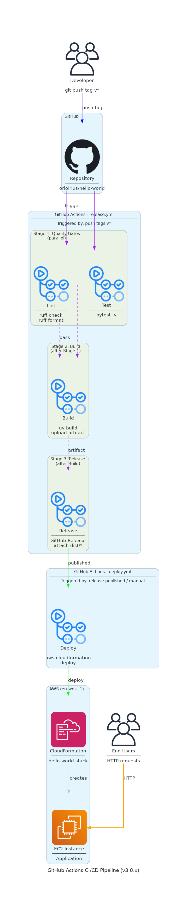

# CI/CD Pipeline Architecture (v5.x)

## Architecture Diagram



## Connection Color Legend

| Color | Meaning |
|-------|---------|
| Blue (#4299E1) | Trigger/Start |
| Green (#48BB78) | Quality gates passed |
| Purple (#9F7AEA) | Release publishing |
| Orange (#ED8936) | Deployment flow |

## Overview

The v5.x release workflow combines continuous integration, container building, and infrastructure deployment into a single automated pipeline.

## Jobs

### lint

Runs code quality checks using ruff.

```yaml
- run: uv run ruff check src/ tests/
- run: uv run ruff format --check src/ tests/
```

### test

Executes the test suite with pytest.

```yaml
- run: uv run pytest -v
```

### build

Builds Python wheel and source distributions.

```yaml
- run: uv build
- uses: actions/upload-artifact@v4
```

**Depends on:** lint, test

### docker

Builds and pushes Docker image to GitHub Container Registry.

```yaml
- uses: docker/build-push-action@v6
  with:
    context: .
    file: docker/Dockerfile
    push: true
```

**Image tags:**
- `latest` (for tagged releases)
- `{version}` (e.g., 5.2.0)
- `{major}.{minor}` (e.g., 5.2)
- `{major}` (e.g., 5)
- `{sha}` (commit SHA)

**Depends on:** lint, test

### release

Creates GitHub Release with wheel artifacts.

```yaml
- uses: softprops/action-gh-release@v2
  with:
    files: dist/*
```

**Depends on:** build

### deploy

Deploys to AWS EC2 using CloudFormation and Ansible.

```yaml
# 1. Delete existing stack
aws cloudformation delete-stack --stack-name ${{ env.STACK_NAME }}

# 2. Create new key pair
aws ec2 create-key-pair --key-name ${{ env.KEY_NAME }}

# 3. Deploy CloudFormation
aws cloudformation deploy --template-file infra/cloudformation.yml

# 4. Run Ansible playbook
uv run ansible-playbook -i inventory.ini playbook.yml
```

**Depends on:** build

## Job Dependencies

```
          ┌─────┐     ┌──────┐
          │lint │     │ test │
          └──┬──┘     └──┬───┘
             │           │
     ┌───────┴───────────┴───────┐
     │                           │
     ▼                           ▼
┌─────────┐                 ┌─────────┐
│  build  │                 │ docker  │
└────┬────┘                 └─────────┘
     │
     ├──────────────┐
     │              │
     ▼              ▼
┌─────────┐   ┌──────────┐
│ release │   │  deploy  │
└─────────┘   └──────────┘
```

## Environment Variables

| Variable | Value | Description |
|----------|-------|-------------|
| `AWS_REGION` | eu-west-1 | AWS region for deployment |
| `STACK_NAME` | hello-world | CloudFormation stack name |
| `KEY_NAME` | hello-world-deploy-key | EC2 key pair name |
| `REGISTRY` | ghcr.io | Container registry |
| `IMAGE_NAME` | ${{ github.repository }} | Docker image name |

## Required Secrets

| Secret | Description |
|--------|-------------|
| `AWS_ACCESS_KEY_ID` | AWS access key for deployment |
| `AWS_SECRET_ACCESS_KEY` | AWS secret key |
| `AWS_SESSION_TOKEN` | AWS session token (if using temporary credentials) |
| `GITHUB_TOKEN` | Auto-provided for container registry |

## Diagram Source

The diagram is generated from `tools/generate_workflows_diagram.py`:

```bash
cd tools
source .venv/bin/activate
python generate_workflows_diagram.py
```

Editable version: [cicd-architecture.drawio](cicd-architecture.drawio)
