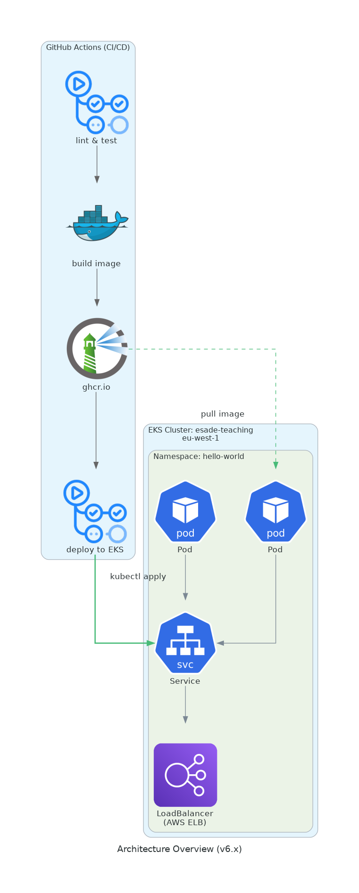

# hello-world

A teaching project that demonstrates the evolution of DevOps practices. The application itself is intentionally trivial — a web server that returns "hello-world" — because the focus is on **how software is built, tested, and delivered**, not the application logic.

## Version Evolution

| Branch | Focus | Key Practice |
|--------|-------|--------------|
| **v1.x** | Manual basics | Run Python script manually |
| **v2.x** | Packaging | `uv build` creates distributable wheel |
| **v3.x** | Infrastructure as Code | CloudFormation + UserData bootstrap |
| **v4.x** | Single-step cloud deploy | CloudFormation UserData installs Docker |
| **v5.x** | Separation of concerns | CloudFormation + Ansible + Docker |

Each version builds on the previous, introducing one new DevOps concept while keeping the application unchanged.

## What This Version Demonstrates (v5.x)

This version introduces **Containerization** with Docker and **Configuration Management** with Ansible:

| Practice                 | Implementation                      |
| ------------------------ | ----------------------------------- |
| Containerization         | Docker image with slim base         |
| Container Registry       | GitHub Container Registry (ghcr.io) |
| Container Orchestration  | Docker Compose for deployment       |
| Infrastructure           | AWS CloudFormation                  |
| Configuration Management | Ansible deploys Docker + Compose    |

### Two-Step Deployment

v5.x separates infrastructure from configuration:

```
CloudFormation → EC2 instance (infrastructure)
Ansible → Install Docker → Pull image → Run container (configuration)
```

### Architecture Overview



### Key Features

| Aspect       | Implementation                             |
| ------------ | ------------------------------------------ |
| Runtime      | Container                                  |
| Dependencies | Bundled in image                           |
| Isolation    | Fully isolated                             |
| Portability  | Any Docker host                            |
| Updates      | Re-run Ansible playbook                    |
| Rollback     | `docker compose down && up` with old tag   |

### Why Docker + Ansible?

1. **Immutable artifacts**: Docker image is the same everywhere
2. **Repeatable configuration**: Ansible can run multiple times safely
3. **Separation of concerns**: Infrastructure vs application deployment
4. **Version pinning**: `image:v5.0.0` guarantees exact version

## Installation

```bash
uv sync
```

## Usage

### Development mode

```bash
uv run hello-world
```

### From virtual environment

```bash
.venv/bin/hello-world
```

### With uvx (no install)

```bash
uvx --from git+https://github.com/oriolrius/hello-world hello-world
```

### From wheel

```bash
uv build
uvx --from ./dist/hello_world-*.whl hello-world
```

## Development

```bash
uv run ruff check src/ tests/   # lint
uv run ruff format src/ tests/  # format
uv run pytest -v                # test
uv build                        # build .tar.gz and .whl
```

## Parameters

| Flag           | Description  | Default     |
| -------------- | ------------ | ----------- |
| `-b, --bind` | Bind address | `0.0.0.0` |
| `-p, --port` | Port number  | `49000`   |

## Examples

```bash
hello-world                        # http://0.0.0.0:49000
hello-world -p 8080                # http://0.0.0.0:8080
hello-world -b 127.0.0.1 -p 3000   # http://127.0.0.1:3000
```

## AWS Deployment

Deployment is a **two-step process**:

1. **CloudFormation** → Provisions AWS infrastructure (VPC, EC2, Security Groups)
2. **Ansible** → Configures the instance (installs Docker, deploys the container)

### Quick Start

```bash
# Step 1: Create SSH key pair
aws ec2 create-key-pair \
  --key-name hello-world-key \
  --region eu-west-1 \
  --query 'KeyMaterial' \
  --output text > ~/.ssh/hello-world-key.pem
chmod 600 ~/.ssh/hello-world-key.pem

# Step 2: Deploy infrastructure with CloudFormation
aws cloudformation deploy \
  --template-file infra/cloudformation.yml \
  --stack-name hello-world \
  --region eu-west-1 \
  --parameter-overrides KeyName=hello-world-key

# Step 3: Get the EC2 public IP
IP=$(aws cloudformation describe-stacks \
  --stack-name hello-world \
  --region eu-west-1 \
  --query 'Stacks[0].Outputs[?OutputKey==`PublicIP`].OutputValue' \
  --output text)

# Step 4: Create Ansible inventory
echo "[hello-world]
$IP ansible_user=ubuntu ansible_ssh_private_key_file=~/.ssh/hello-world-key.pem" > deploy/inventory.ini

# Step 5: Deploy the application with Ansible
uv run ansible-galaxy collection install -r deploy/requirements.yml
cd deploy && uv run ansible-playbook -i inventory.ini playbook.yml

# Step 6: Test the deployment
curl http://$IP:49000
```

### What CloudFormation Creates

| Resource         | Description                    |
| ---------------- | ------------------------------ |
| VPC              | 10.0.0.0/16 with DNS support   |
| Subnet           | Public subnet 10.0.1.0/24      |
| Internet Gateway | For public internet access     |
| Security Group   | Ports 22 (SSH) and 49000 (app) |
| EC2 Instance     | t3a.micro with Ubuntu 24.04 LTS |

### What Ansible Installs

| Task             | Description                    |
| ---------------- | ------------------------------ |
| Install Docker   | Docker Engine + Compose plugin |
| Deploy container | Pull image from ghcr.io        |
| Start service    | Run with Docker Compose        |

See [`deploy/README.md`](deploy/README.md) for detailed Ansible documentation.

### CloudFormation Parameters

| Parameter     | Description                 | Default       |
| ------------- | --------------------------- | ------------- |
| `KeyName`   | EC2 Key Pair for SSH access | _(none)_      |
| `AllowedIP` | CIDR for SSH access         | `0.0.0.0/0`   |

### Service Management

```bash
# Check container status
ssh -i ~/.ssh/hello-world-key.pem ubuntu@$IP \
  "sudo docker compose -f /opt/hello-world/docker-compose.yml ps"

# View logs
ssh -i ~/.ssh/hello-world-key.pem ubuntu@$IP \
  "sudo docker compose -f /opt/hello-world/docker-compose.yml logs -f"

# Restart service
ssh -i ~/.ssh/hello-world-key.pem ubuntu@$IP \
  "sudo docker compose -f /opt/hello-world/docker-compose.yml restart"
```

### Cleanup

```bash
aws cloudformation delete-stack \
  --stack-name hello-world \
  --region eu-west-1
```

### GitHub Actions Deployment

The `release.yml` workflow runs on tag push or manual trigger.

**Required secrets:**

- `AWS_ACCESS_KEY_ID`
- `AWS_SECRET_ACCESS_KEY`
- `AWS_SESSION_TOKEN` _(if using SSO)_

```bash
# Set secrets
gh secret set AWS_ACCESS_KEY_ID --body "your-key"
gh secret set AWS_SECRET_ACCESS_KEY --body "your-secret"

# Trigger manual deployment
gh workflow run release.yml
```
