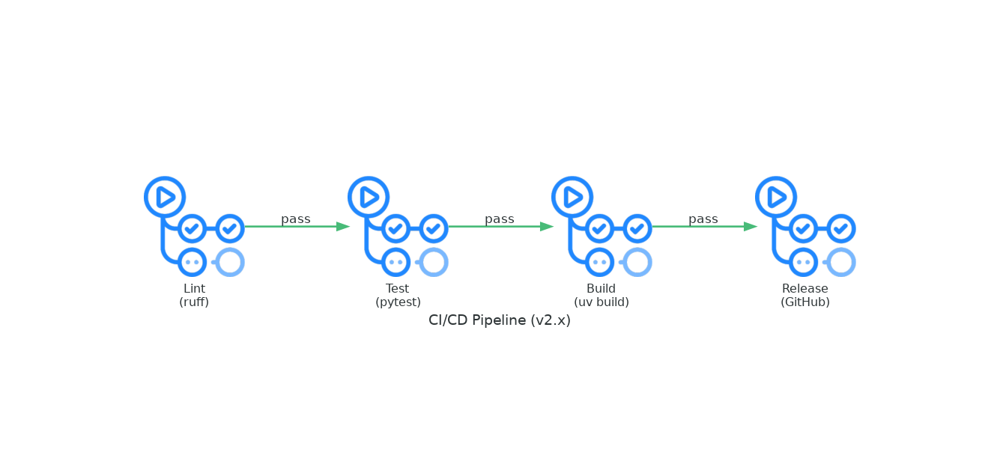

# hello-world

A teaching project that demonstrates the evolution of DevOps practices. The application itself is intentionally trivial — a web server that returns "hello-world" — because the focus is on **how software is built, tested, and delivered**, not the application logic.

## What This Version Demonstrates (v2.x)

This version introduces **CI/CD fundamentals** with GitHub Actions:

| Practice     | Implementation                           |
| ------------ | ---------------------------------------- |
| Code Quality | Automated linting with `ruff`          |
| Testing      | Unit tests with `pytest`               |
| Build        | Python wheel packaging with `uv build` |
| Release      | Automated GitHub releases on tag push    |

### Evolution from v1.x

- **v1.x**: Manual development — run locally, no automation
- **v2.x**: Introduces the CI/CD pipeline — code is automatically checked, tested, built, and released when you push a tag

The workflow (`release.yml`) runs: `lint → test → build → release`



**Key learning**: Automation ensures consistent quality — every release is linted, tested, and packaged the same way.

## Installation

```bash
uv sync
```

## Usage

### Development mode

```bash
uv run hello-world
```

### From virtual environment

```bash
.venv/bin/hello-world
```

### With uvx (no install)

```bash
uvx --from git+https://github.com/oriolrius/hello-world hello-world
```

### From wheel

```bash
uv build
uvx --from ./dist/hello_world-2.0.3-py3-none-any.whl hello-world
```

## Parameters

| Flag           | Description  | Default     |
| -------------- | ------------ | ----------- |
| `-b, --bind` | Bind address | `0.0.0.0` |
| `-p, --port` | Port number  | `49000`   |

## Examples

```bash
hello-world                        # http://0.0.0.0:49000
hello-world -p 8080                # http://0.0.0.0:8080
hello-world -b 127.0.0.1 -p 3000   # http://127.0.0.1:3000
```


