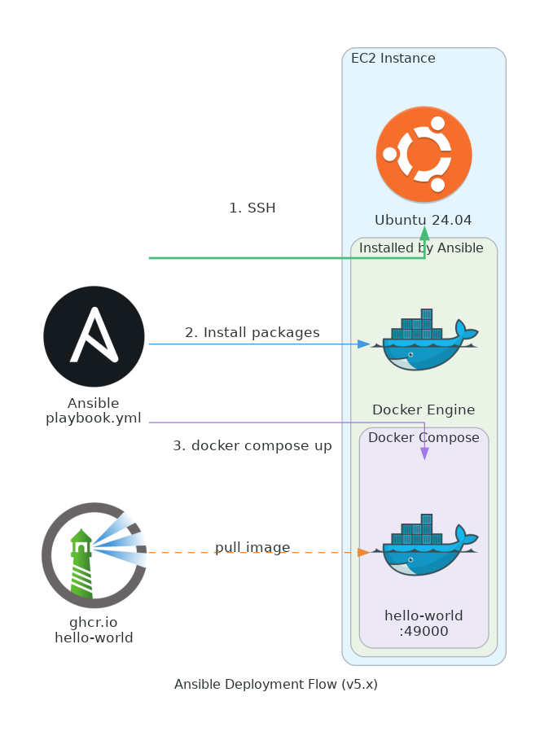

# Ansible Deployment - v5.0.x

Ansible playbook for deploying hello-world to EC2 instances using Docker Compose.

## Quick Start

```bash
# Install dependencies
uv sync --dev
uv run ansible-galaxy collection install -r deploy/requirements.yml

# Create inventory (edit with your EC2 IP)
cp deploy/inventory.ini.example deploy/inventory.ini

# Deploy
cd deploy
uv run ansible-playbook -i inventory.ini playbook.yml
```

## Prerequisites

- EC2 instance running Ubuntu 24.04
- SSH access to the instance
- Ansible installed (`uv sync --dev`)

## What Gets Installed

1. Docker Engine
2. Docker Compose plugin
3. hello-world container from ghcr.io

## Files

| File | Description |
|------|-------------|
| `playbook.yml` | Main Ansible playbook |
| `inventory.ini.example` | Example inventory file |
| `ansible.cfg` | Ansible configuration |
| `requirements.yml` | Ansible Galaxy requirements |
| `docker-compose.yml.j2` | Docker Compose template |
| `docs/` | Architecture documentation |

## Variables

| Variable | Default | Description |
|----------|---------|-------------|
| `app_dir` | /opt/hello-world | Install directory |
| `image_tag` | v5 | Docker image tag |

## Service Management

```bash
# Check status
ssh ubuntu@<IP> "sudo docker compose -f /opt/hello-world/docker-compose.yml ps"

# View logs
ssh ubuntu@<IP> "sudo docker compose -f /opt/hello-world/docker-compose.yml logs -f"

# Restart
ssh ubuntu@<IP> "sudo docker compose -f /opt/hello-world/docker-compose.yml restart"
```

## Architecture

See [docs/ARCHITECTURE.md](docs/ARCHITECTURE.md) for detailed documentation.


