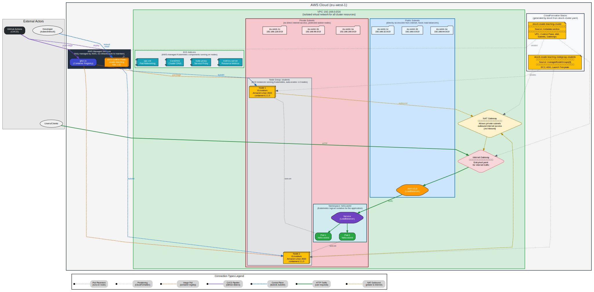

# EKS Architecture: esade-teaching

This document describes the AWS infrastructure architecture for the `esade-teaching` EKS cluster, created from `eksctl-cluster.yaml`.

## Architecture Diagram



### Connection Color Legend

| Color | Line Style | Meaning |
|-------|------------|---------|
| **Green** | Solid, thick | User HTTP traffic flow |
| **Blue** | Dashed | Control plane / kubectl commands |
| **Purple** | Solid/Dashed | CI/CD pipeline (GitHub Actions) |
| **Orange** | Dashed | Container image pulls |
| **Amber** | Dashed | Outbound NAT traffic |
| **Gray** | Dotted | Infrastructure provisioning / Pod placement |

## Overview

The architecture follows AWS best practices for EKS deployments with a multi-AZ VPC design, managed node groups, and separation of public/private subnets.

## Components

### CloudFormation Stacks

When `eksctl create cluster -f eksctl-cluster.yaml` is executed, eksctl generates and deploys two CloudFormation stacks:

| Stack | Resources Created |
|-------|-------------------|
| `eksctl-esade-teaching-cluster` | VPC, Subnets, Internet Gateway, NAT Gateway, Route Tables, EKS Control Plane, IAM Roles, Security Groups, OIDC Provider |
| `eksctl-esade-teaching-nodegroup-students` | EC2 Launch Template, Auto Scaling Group, Node IAM Role, Node Security Group |

### VPC Architecture

```
VPC CIDR: 192.168.0.0/16
├── Public Subnets (Internet-facing)
│   ├── eu-west-1a: 192.168.64.0/19
│   ├── eu-west-1b: 192.168.0.0/19
│   └── eu-west-1c: 192.168.32.0/19
│
└── Private Subnets (Workloads)
    ├── eu-west-1a: 192.168.160.0/19
    ├── eu-west-1b: 192.168.96.0/19
    └── eu-west-1c: 192.168.128.0/19
```

**Design Rationale:**
- **3 Availability Zones**: High availability across `eu-west-1a`, `eu-west-1b`, `eu-west-1c`
- **Public Subnets**: Host the Internet Gateway, NAT Gateway, and Load Balancers
- **Private Subnets**: Host worker nodes (no direct internet access for security)

### Network Components

| Component | Purpose | Location |
|-----------|---------|----------|
| **Internet Gateway** | Enables internet access for public subnets | VPC level |
| **NAT Gateway** | Enables outbound internet access for private subnets (image pulls, updates) | Public subnet |
| **Route Tables** | Direct traffic: public → IGW, private → NAT | Per subnet type |

### EKS Control Plane

The EKS control plane is **fully managed by AWS**:

- **High Availability**: Runs across multiple AZs
- **Automatic Scaling**: AWS manages capacity
- **Automatic Updates**: Security patches applied automatically
- **API Endpoint**: `https://<cluster-id>.gr7.eu-west-1.eks.amazonaws.com`

You only pay for the control plane (~$73/month), not the underlying infrastructure.

### Managed Node Group: students

| Property | Value |
|----------|-------|
| Instance Type | t3.medium (2 vCPU, 4 GB RAM) |
| AMI | Amazon Linux 2023 |
| Container Runtime | containerd 2.1.5 |
| Desired Capacity | 2 nodes |
| Min/Max | 1-3 nodes (Auto Scaling) |
| Volume | 20 GB gp3 |
| Subnet Placement | Private subnets |

**Managed Node Group Benefits:**
- AWS handles node provisioning, updates, and termination
- Integrated with EKS for seamless Kubernetes updates
- Auto Scaling Group manages capacity based on demand

### EKS Add-ons

Add-ons are Kubernetes components managed by AWS:

| Add-on | Version | Purpose |
|--------|---------|---------|
| **vpc-cni** | v1.20.4 | AWS VPC CNI for pod networking (assigns VPC IPs to pods) |
| **kube-proxy** | v1.32.6 | Kubernetes service proxy (iptables rules) |
| **CoreDNS** | v1.11.4 | Cluster DNS resolution |
| **metrics-server** | v0.8.0 | Resource metrics for HPA and `kubectl top` |

### Application Layer

The hello-world application runs in the `hello-world` namespace:

```
Namespace: hello-world
├── Deployment: hello-world (2 replicas)
│   ├── Pod 1 → Node 1
│   └── Pod 2 → Node 2
└── Service: hello-world (type: LoadBalancer)
    └── AWS ELB (Classic/NLB)
```

## Traffic Flow

### Inbound (User Request)

```
User → Internet → Internet Gateway → AWS ELB → Service → Pod
```

1. User sends HTTP request to ELB DNS name
2. Request enters VPC via Internet Gateway
3. ELB (in public subnet) receives the request
4. ELB forwards to Kubernetes Service
5. Service load-balances to healthy Pods
6. Pod processes request and returns response

### Outbound (Container Image Pull)

```
Pod → Node → NAT Gateway → Internet Gateway → ghcr.io
```

1. kubelet on node needs to pull container image
2. Request goes to NAT Gateway (private → public subnet)
3. NAT Gateway routes through Internet Gateway
4. Image downloaded from container registry

### Control Plane Communication

```
kubectl → EKS API Endpoint → Control Plane → kubelet (on nodes)
```

1. Developer/CI runs kubectl command
2. Request goes to EKS API endpoint (public)
3. Control plane processes request
4. Instructions sent to kubelet on worker nodes

## Security Architecture

### Network Security

| Layer | Security Control |
|-------|-----------------|
| VPC | Private subnets for workloads |
| Subnets | NACL rules (default allow) |
| Nodes | Security Groups (EKS-managed) |
| Pods | Network Policies (optional) |

### IAM Roles

| Role | Purpose |
|------|---------|
| Cluster Role | EKS control plane permissions |
| Node Role | EC2 instances permissions (ECR, EBS, etc.) |
| Pod Roles | IRSA for pod-level AWS access (not configured) |

### Current Security Posture

| Feature | Status | Production Recommendation |
|---------|--------|--------------------------|
| API Endpoint | Public | Enable private endpoint |
| OIDC Provider | Disabled | Enable for IRSA |
| CloudWatch Logging | Disabled | Enable audit logs |
| Secrets Encryption | Default | Enable KMS encryption |

## Scaling

### Node Auto Scaling

The node group scales between 1-3 nodes based on pending pods:

```bash
# Scale manually
eksctl scale nodegroup --cluster=esade-teaching --name=students --nodes=3

# Or let Cluster Autoscaler handle it (not installed)
```

### Pod Auto Scaling

With metrics-server installed, you can configure HPA:

```yaml
apiVersion: autoscaling/v2
kind: HorizontalPodAutoscaler
metadata:
  name: hello-world
spec:
  scaleTargetRef:
    apiVersion: apps/v1
    kind: Deployment
    name: hello-world
  minReplicas: 2
  maxReplicas: 10
  metrics:
  - type: Resource
    resource:
      name: cpu
      target:
        type: Utilization
        averageUtilization: 50
```

## Cost Breakdown

| Component | Monthly Cost | Notes |
|-----------|--------------|-------|
| EKS Control Plane | ~$73 | Fixed cost |
| 2x t3.medium | ~$60 | On-demand pricing |
| NAT Gateway | ~$33 | Data processing + hourly |
| EBS (40 GB gp3) | ~$4 | 2 nodes × 20 GB |
| ELB | ~$18 | Classic LB + data |
| **Total** | **~$188/month** | |

## Diagram Source

The architecture diagram is generated from `architecture.dot` using GraphViz:

```bash
# Regenerate SVG
pip install graphviz
python3 -c "
import graphviz
with open('architecture.dot', 'r') as f:
    source = graphviz.Source(f.read())
    source.render('architecture', format='svg', cleanup=True)
"
```

## References

- [Amazon EKS User Guide](https://docs.aws.amazon.com/eks/latest/userguide/)
- [eksctl Documentation](https://eksctl.io/)
- [AWS VPC User Guide](https://docs.aws.amazon.com/vpc/latest/userguide/)
- [Kubernetes on AWS Best Practices](https://aws.github.io/aws-eks-best-practices/)
