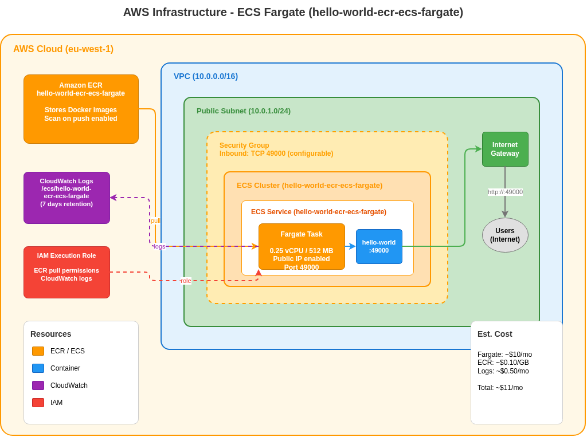

# AWS Infrastructure Architecture (v4.x)

## Architecture Diagram



## Connection Color Legend

| Color | Meaning |
|-------|---------|
| Blue (#4299E1) | Network traffic flow |

## Overview

The v4.x infrastructure creates a minimal AWS environment for running the hello-world application on EC2. The application is bootstrapped via CloudFormation UserData, which installs Docker and deploys the container automatically on instance launch.

## Resources Created

### Networking

| Resource | Type | Configuration |
|----------|------|---------------|
| VPC | AWS::EC2::VPC | CIDR: 10.0.0.0/16 |
| Internet Gateway | AWS::EC2::InternetGateway | Attached to VPC |
| Public Subnet | AWS::EC2::Subnet | CIDR: 10.0.1.0/24, Auto-assign public IP |
| Route Table | AWS::EC2::RouteTable | 0.0.0.0/0 → Internet Gateway |

### Compute

| Resource | Type | Configuration |
|----------|------|---------------|
| EC2 Instance | AWS::EC2::Instance | t3a.micro, Ubuntu 24.04 LTS |
| Security Group | AWS::EC2::SecurityGroup | Inbound: 22 (SSH), 49000 (app) |

## CloudFormation Parameters

| Parameter | Description | Default |
|-----------|-------------|---------|
| `KeyName` | EC2 Key Pair for SSH access | (none) |
| `AllowedIP` | CIDR for SSH access | 0.0.0.0/0 |

## Stack Outputs

| Output | Description |
|--------|-------------|
| `PublicIP` | EC2 instance public IP |
| `PublicDNS` | EC2 instance public DNS name |
| `ServiceURL` | Full URL to access the service |

## Deployment

### Deploy Stack

```bash
aws cloudformation deploy \
  --template-file infra/cloudformation.yml \
  --stack-name hello-world \
  --parameter-overrides KeyName=my-key-pair \
  --region eu-west-1
```

### Get Outputs

```bash
aws cloudformation describe-stacks \
  --stack-name hello-world \
  --query 'Stacks[0].Outputs' \
  --output table
```

### Delete Stack

```bash
aws cloudformation delete-stack --stack-name hello-world
aws cloudformation wait stack-delete-complete --stack-name hello-world
```

## Cost Estimation

| Resource | Estimated Monthly Cost |
|----------|----------------------|
| EC2 t3.micro | ~$8.50 (on-demand) |
| Data transfer | Variable |
| **Total** | ~$10/month |

*Free tier eligible for first 12 months.*

## Security Considerations

| Aspect | Implementation |
|--------|----------------|
| SSH Access | Configurable via `AllowedIP` parameter |
| Application Port | Open to 0.0.0.0/0 (public) |
| Instance Metadata | Default (v1 + v2) |
| Encryption | Not enabled (demo purposes) |

## Diagram Source

The diagram is generated from `tools/generate_infra_diagram.py`:

```bash
cd tools
source .venv/bin/activate
python generate_infra_diagram.py
```

Editable version: [infra-architecture.drawio](infra-architecture.drawio)
