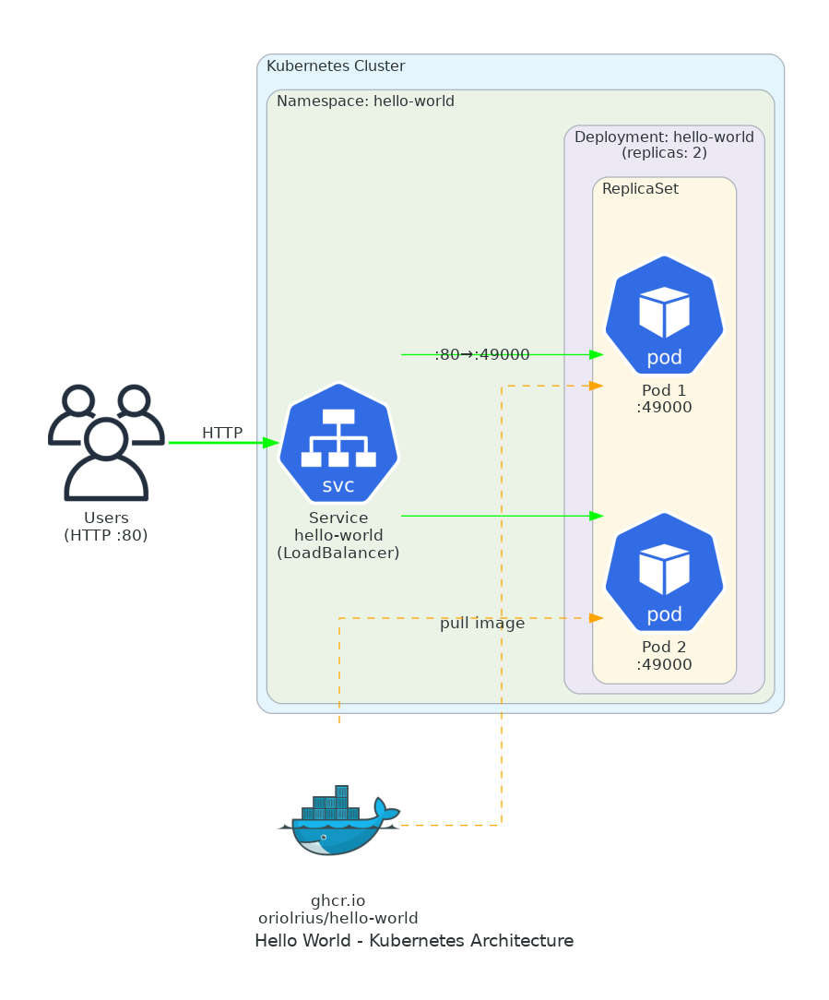

# Hello World - Kubernetes Architecture

This document describes the Kubernetes deployment architecture for the hello-world application.



## Overview

The hello-world application is deployed as a containerized workload on Kubernetes using a standard deployment pattern with load balancing.

## Components

### Namespace

```yaml
name: hello-world
```

A dedicated namespace isolates all resources for this application, providing:
- Resource organization and grouping
- Access control boundaries
- Resource quota management

### Deployment

```yaml
name: hello-world
replicas: 2
image: ghcr.io/oriolrius/hello-world:latest
containerPort: 49000
```

The Deployment manages Pod lifecycle with:
- **2 replicas** for high availability
- **Liveness probe**: HTTP GET on `/` every 10s (detects dead containers)
- **Readiness probe**: HTTP GET on `/` every 5s (controls traffic routing)
- **Resource limits**: 50-200m CPU, 64-128Mi memory

### Service

```yaml
name: hello-world
type: LoadBalancer
port: 80 → targetPort: 49000
```

The Service exposes the application externally:
- **LoadBalancer** type provisions an AWS ELB (when running on EKS)
- Routes traffic from port **80** to container port **49000**
- Automatic load balancing across healthy pods

## Traffic Flow

```
Users → LoadBalancer:80 → Service → Pod 1:49000
                                  → Pod 2:49000
```

1. Users send HTTP requests to the LoadBalancer on port 80
2. The Service routes requests to available pods
3. Pods respond from their container port 49000

## Deployment with Kustomize

The manifests are managed with Kustomize for easy customization:

```bash
# Preview the manifests
kubectl kustomize k8s/

# Apply to cluster
kubectl apply -k k8s/

# Update image tag
cd k8s && kustomize edit set image ghcr.io/oriolrius/hello-world:v1.0.0
```

## Files

| File | Purpose |
|------|---------|
| `namespace.yaml` | Creates the hello-world namespace |
| `deployment.yaml` | Defines the application deployment with 2 replicas |
| `service.yaml` | Exposes the application via LoadBalancer |
| `kustomization.yaml` | Kustomize configuration for managing manifests |

## Connection Types

| Color | Description |
|-------|-------------|
| Green | HTTP traffic flow (user requests) |
| Orange (dashed) | Container image pull from registry |

## Editable Diagram

The architecture diagram is available in editable format:
- `k8s-architecture.drawio` - Open with [draw.io](https://app.diagrams.net/)
